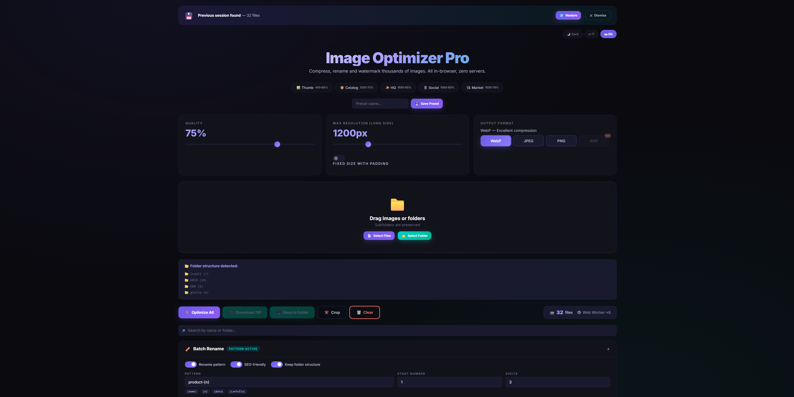
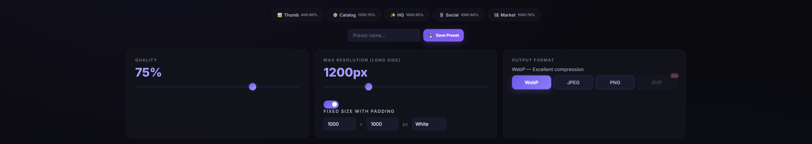
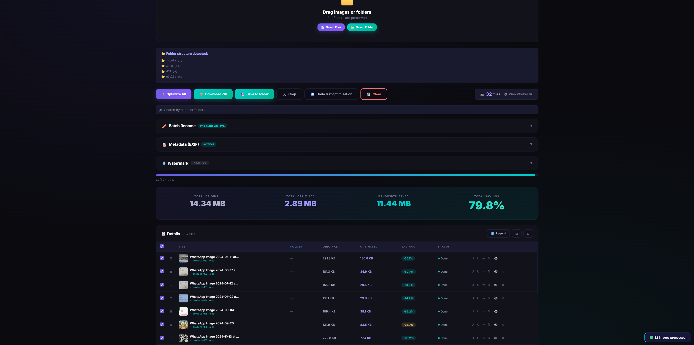
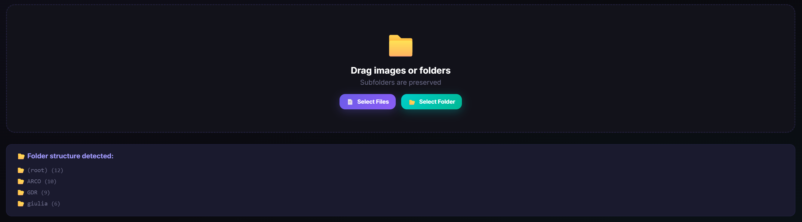
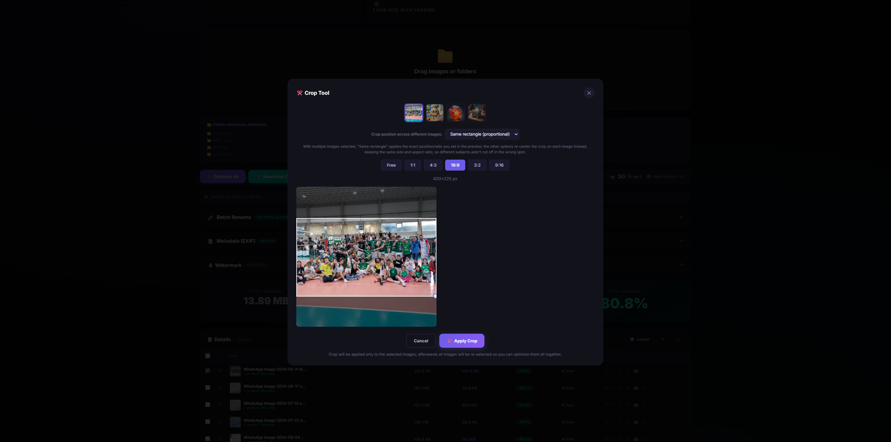
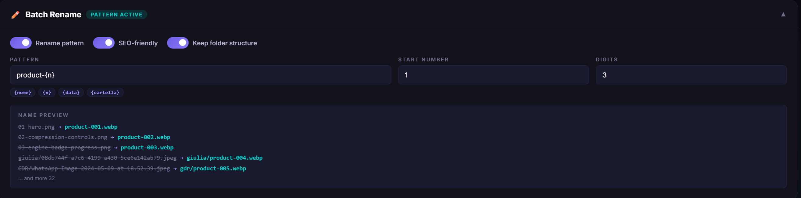
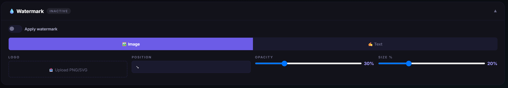
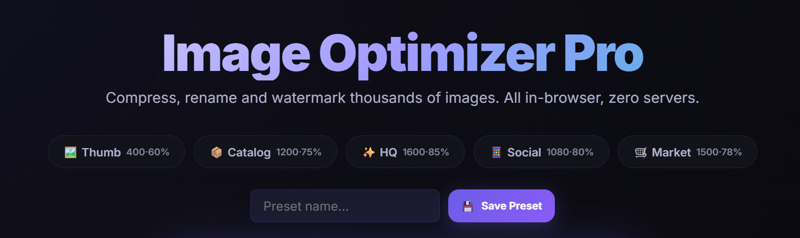

# 🖼️ Image Optimizer Pro

> Compress, rename and watermark thousands of images directly in your browser.
> Zero servers. Zero uploads. A single HTML file. Multi-threaded.
>
> IT: Comprimi, rinomina e applica watermark a migliaia di immagini direttamente nel browser.
> Zero server. Zero upload. Un singolo file HTML. Multi-thread.




---

## 🤔 Why this exists

I frequently needed to resize and compress images for various projects, but I always hated the available options:

- **Desktop apps** are heavy to install and slow to update
- **Online services** (TinyPNG, iLoveIMG, etc.) require uploading files to third-party servers, have per-session limits, and some are paid
- **Squoosh** by Google is great but doesn't handle batch processing

So I built my own. Once I got the basic compression working, I got carried away and kept adding features I wished existed — including, eventually, real background processing so it doesn't choke on a few hundred images.

---

## ✨ Features

### 🗜️ Compression
- Input support for **PNG, JPEG, GIF, BMP, TIFF**
- Output in **WebP, JPEG, PNG** or **AVIF** (with automatic browser detection)
- Slider for quality (10–100%) and max resolution (200–4000px long side)
- **Fixed dimensions with padding** — set exact width × height (e.g. 1000×1000 for marketplaces) with white/black/transparent/custom color padding
- **Automatic format fallback**: if your browser can't actually encode the format you picked (this is common for AVIF, and happens silently in some browsers), the tool falls back to WebP → JPEG → PNG in order, verifies the result really matches the format it claims to be, and flags the affected files so nothing gets zipped with the wrong extension



### ⚡ Performance & Architecture
- **Real parallel processing via a Web Worker pool** (sized to your CPU cores, up to 6) using `OffscreenCanvas` — the browser tab never freezes, even on large batches, because all the decoding/resizing/encoding happens off the main thread
- Automatic **graceful fallback to main-thread processing** on browsers without `OffscreenCanvas` support (e.g. older Safari) — same features, same output, just single-threaded
- A small **engine indicator** in the toolbar shows you which mode is active ("⚙️ Web Worker ×4" or "⚙️ Main thread")
- Careful **memory management**: images are decoded via `createImageBitmap` and explicitly released with `.close()` right after use instead of waiting on garbage collection; preview object URLs are revoked instead of leaking
- Progress bar with **live ETA** based on actual throughput



### 📁 Upload & Folders
- **Drag & drop** single files, multiple selection, or **entire folders**
- Dedicated buttons: "📄 Select Files" and "📂 Select Folder"
- Complete subfolder recursion
- **Visual folder structure panel** showing detected folders and file count per folder
- **Dedicated "Folder" column** in the table showing where each file lives
- Option to **preserve folder structure** in the final export



### 🔎 Search, Sort & Duplicate Detection
- **Search bar (🔎)** (appears automatically once you have more than a few files) to filter by name, folder or custom name, with a one-click clear button
- **Sortable columns** — click "Original", "Optimized", "Savings" or "Status" to reorder the table, click again to reverse
- **Duplicate detection**: files sharing the same name and size are flagged (⧉), with a one-click "🧹 Remove duplicates" button
- An **icon legend (ℹ️)** panel explains every icon and badge in the table for anyone opening the tool for the first time

### ✂️ Crop
- Freeform or fixed-ratio cropping (1:1, 4:3, 16:9, 3:2, 9:16)
- Works on **selected images only** — the rest stay untouched and everything gets re-selected afterward so you can still optimize the whole batch together
- With **multiple images selected**, a thumbnail strip lets you switch which image you're previewing the crop against
- A **crop anchor selector** (same rectangle / centered / top / bottom / left / right / four corners) lets you re-center the crop on each image individually instead of forcing an identical rectangle on every photo — useful when your selected images don't all frame the subject the same way



### 🔄 Rotate & Flip
- Per-image rotate left/right and horizontal/vertical flip, applied during export
- A small badge on each row shows the active transform (e.g. `90°` or a flip indicator)


### ✏️ Rename
- **Batch pattern** with placeholders:
  - `{nome}` → original file name
  - `{n}` → progressive number (with configurable zero-padding)
  - `{data}` → today's date (YYYY-MM-DD format)
  - `{cartella}` → source folder name
- **Inline rename**: click any name in the table to edit it directly
- **SEO-friendly** toggle: lowercase, accent removal, spaces → hyphens
- Live preview of final names including folder paths before processing



### 💧 Watermark
Two modes available via tab selector:

**Image watermark:**
- Upload your logo in **PNG or SVG**
- Choose **position** (5 options: corners + center)
- Control **opacity** and **size** (% relative to image)
- **Live preview** on canvas

**Text watermark:**
- Custom text (e.g. `© My Brand`)
- Choose **font** (Inter, Arial, Georgia, Courier New, Verdana)
- Custom **color** picker
- **Opacity**, **size** and **rotation** controls (0°, -30°, -45° diagonal)
- **Position** selector (5 points)
- **Live preview** on canvas



### ↩️ Undo & 💾 Session Persistence
- **Undo last optimization (↩️)** — one click reverts the most recent batch to its pre-optimization state
- The whole workspace (files, crop, rotation, rename, selection) is **saved automatically to IndexedDB** as you work
- Reloading the page (or coming back later) shows a banner offering to **restore your previous session** — all local, nothing ever leaves the browser


### ⭐ Presets

| Preset | Resolution | Quality | Format |
|--------|-----------|---------|--------|
| Thumbnail | 400px | 60% | WebP |
| Catalog | 1200px | 75% | WebP |
| High Quality | 1600px | 85% | WebP |
| Social | 1080px | 80% | WebP |
| Marketplace | 1500px | 78% | JPEG |

**Custom presets:** Save your own presets with custom names — stored in `localStorage` and persisted across sessions. Delete them anytime with one click.



### 📊 Dashboard
- Live table with thumbnail, original/optimized size, % savings per file
- **Dedicated folder column** showing each file's source folder
- **Select/deselect** individual files or all at once — optimize only what you need
- **Retry button (🔄)** on individual failed files
- Banner with **total bandwidth savings** in MB/GB
- **Estimated time remaining** during processing
- **Before/after preview (👁️)** by clicking any completed row

### 🌙☀️ Light & Dark Mode
- Toggle between dark and light themes (🌙/☀️)
- Preference saved in `localStorage` — remembered across sessions
- Smooth CSS transition between themes
- Watermark preview canvas adapts to current theme colors

### 🌐 Multilingual (i18n)
- Full **Italian** and **English** interface
- Language switcher in the top-right corner
- Preference saved in `localStorage`
- All UI elements translated: controls, panels, table headers, status labels, toast notifications, placeholders, tooltips

### 📲 PWA (Progressive Web App)
- **Installable** as a native app on desktop and mobile
- Works **100% offline** after first load
- Service Worker with cache-first strategy
- "📲 Install as App" button appears automatically on supported browsers
- Opens without browser chrome (standalone mode)


### 📦 Export
- Download everything in a **ZIP archive (📦)** with one click
- **Save directly to a folder on disk (💾)** via the File System Access API on Chrome/Edge — no ZIP step, files land straight into the folder you pick (with folder structure preserved); on browsers without this API (Firefox, Safari) the button automatically falls back to the ZIP download with a clear explanation instead of silently failing or disappearing
- Original folder structure optionally preserved
- Automatic **duplicate name handling**
- SEO-friendly folder names in the ZIP when slugification is active

---

## 🚀 How to use

Nothing to install.

**Option A — Online:**
[Open the live demo](https://gdr-sys.github.io/Image-Optimizer-Pro/)

**Option B — Offline:**
1. Clone the repo or download `index.html`
2. Open it in any modern browser
3. Done.

```bash
git clone https://github.com/yourusername/image-optimizer-pro.git
cd image-optimizer-pro
# open index.html in your browser
```

### Browser support notes

| Feature | Chrome/Edge | Firefox | Safari |
|---|---|---|---|
| Core compression, rename, crop, watermark, ZIP export | Yes | Yes | Yes |
| Web Worker + `OffscreenCanvas` (multi-threaded) | Yes | Yes | Recent versions only |
| AVIF encoding | Rarely, falls back automatically | Rarely, falls back automatically | Rarely, falls back automatically |
| Save directly to folder (File System Access API) | Yes | No — falls back to ZIP | No — falls back to ZIP |
| PWA install | Yes | Yes | Yes |

---

## 📄 License

MIT
